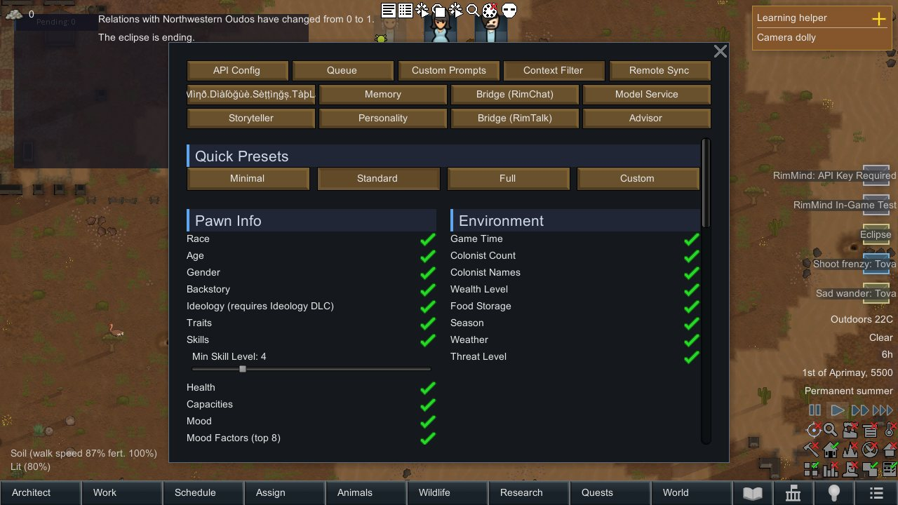
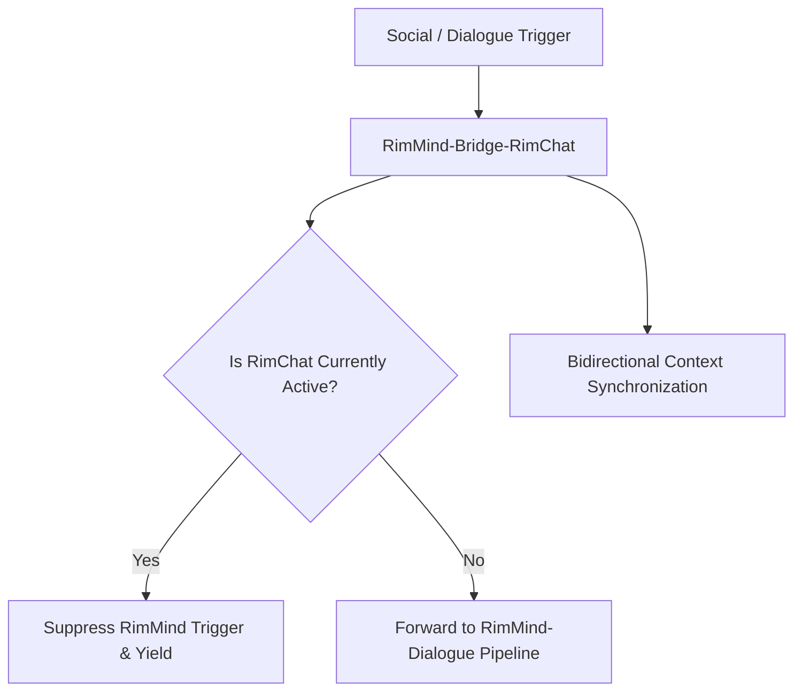

<div align="center">

# RimMind-Bridge-RimChat 🌉
### Seamless Compatibility Bridge & Mutual Exclusion Gating for RimWorld 1.6

**English** | [简体中文](README_zh.md)

<p>
  <a href="https://rimworldgame.com/"></a>
  <a href="https://github.com/mcocdaa/RimWorld-RimMind-Mod-Core"></a>
  <a href="#"></a>
  <a href="LICENSE"></a>
</p>

<p><em>Enables seamless coexistence with the RimChat mod without conflicting dialogue bubbles or duplicated actions.</em></p>

</div>

---

## 📖 Overview

**RimMind-Bridge-RimChat** provides intelligent mutual exclusion gating and state synchronization when playing with both **RimMind** and the third-party **RimChat** mod simultaneously. It prevents overlapping overhead dialogue spam, deconflicts job dispatches, and shares interaction cooldowns.

### Key Capabilities
- **Dialogue Gating**: Automatically detects RimChat's conversational active window and suppresses duplicate RimMind dialogue triggers on the same colonist.
- **Action Deconfliction**: Ensures composite mechanism actions and RimChat job orders never collide on target pawns.
- **Context Synchronization**: Safely extracts recent RimChat diplomatic dialogues into RimMind's cognitive memory layers.

---

## 🎮 In-Game Showcase


*Harmonious coexistence in action: Both RimMind and RimChat active in the same colony without overlapping dialogue bubbles or job conflicts.*

---

## 🏛️ Gating Architecture



---

## 🛠️ Installation & Load Order

```text
1. Harmony
2. Core (Vanilla RimWorld)
3. RimChat (Optional third-party mod)
4. RimMind-Core
5. RimMind-Bridge-RimChat
```

---

## 🧪 Developer Guide & Testing

Run unit tests directly:

```powershell
dotnet test RimMind-Bridge-RimChat/Tests/RimMindBridgeRimChat.Tests.csproj -c Release
```

---

## 📜 License

Licensed under the [MIT License](LICENSE).
