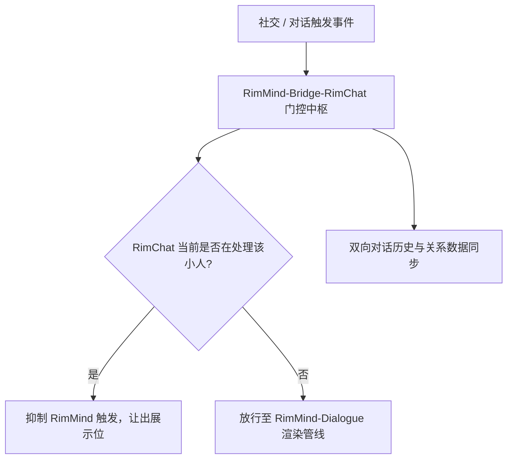

<div align="center">

# RimMind-Bridge-RimChat 🌉
### 专为 RimWorld 1.6 打造的 RimChat 模组兼容桥、门控互斥与上下文同步系统

[English](README.md) | **简体中文**

<p>
  <a href="https://rimworldgame.com/"></a>
  <a href="https://github.com/mcocdaa/RimWorld-RimMind-Mod-Core"></a>
  <a href="#"></a>
  <a href="LICENSE"></a>
</p>

<p><em>实现与流行模组 RimChat 的丝滑共存，杜绝气泡重叠打架与动作冲突。</em></p>

</div>

---

## 📖 模块概览

**RimMind-Bridge-RimChat** 为同时安装了 **RimMind** 和流行第三方模组 **RimChat** 的玩家提供智能的门控互斥与上下文同步机制。它能够在后台自动辨识对方的运行状态，防止头顶对话气泡遮挡与动作派发撞车。

### 核心特性
- **对话门控互斥**：自动侦测 RimChat 的活动窗口，对同一目标小人智能避让，避免双方同时弹出对话气泡。
- **动作防撞车协同**：确保复合机制动作与 RimChat 的任务调度互不干扰，保障小人行动平滑顺畅。
- **双向上下文同步**：安全提取 RimChat 中的外交与 RPG 对话历史，转化为 RimMind 认知上下文，实现双 AI 强强联合。

---

## 🎮 实机特性展示


*双模组协同实机展示：RimMind 与 RimChat 同时加载运行，界面清爽无冲突，气泡有序交替展示。*

---

## 🏛️ 门控流转架构



---

## 🛠️ 安装与加载顺序

```text
1. Harmony
2. Core (RimWorld 原版)
3. RimChat (第三方模组，可选)
4. RimMind-Core
5. RimMind-Bridge-RimChat
```

---

## 🧪 开发者测试指南

运行单元测试：

```powershell
dotnet test RimMind-Bridge-RimChat/Tests/RimMindBridgeRimChat.Tests.csproj -c Release
```

---

## 📜 开源协议

本项目采用 [MIT License](LICENSE) 开源许可证。
